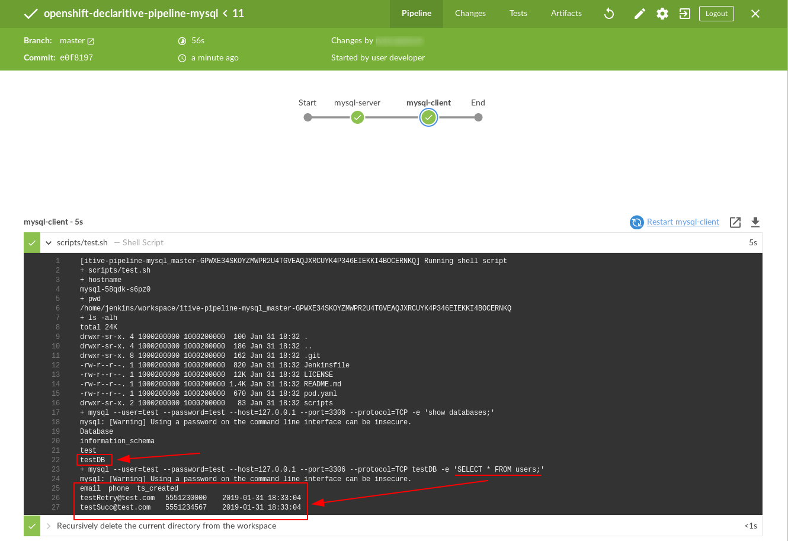

# openshift-declaritive-pipeline-mysql

## what is this?
An example declaritive jenkins pipeline script that launches a kubernetes pod in OpenShift, with 3 containers:
- mysql-client
- mysql-server
- jnlp

## what does the pipeline do?
- Creates a database called "testDB" in the "mysql-server" container, creates a table called "users" and loads some test data into the table.
- From the "mysql-client" container, connect to the "mysql-server"container over TCP and run a SQL QUERY of `SELECT * FROM users`.

## results

## requirements
- [requirements.md](requirements.md)

## resources
- [resources.md](resources.md)