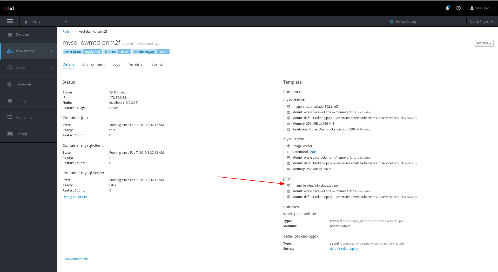

# Jenkins Kubernetes plugin Vs. Docker plugin

## Docker plugin
- [docker-plugin](https://github.com/jenkinsci/docker-plugin)
> This plugin allows you to connect docker host(s) to your jenkins server, and assign jenkins agent labels to different container templates. When a jenkins job using that label starts, jenkins will spin up a container, register the container as a jenkins agent, run the jenkins job on the container, and then destroy the container once the job is complete.

### Pros
- Containers spin up and register as jenkins agents very quickly (in ms), much faster than waiting for a virtual machine to spin up.

### Cons
- Any container image you want to use must also include the jenkins/jnlp-slave/jdk stuff for it to successfully register as a jenkins agent. You cannot simply pull down a docker image from DockerHub and spin it up as a Jenkins agent; you would have to use [this approach](https://jenkins.io/doc/book/pipeline/docker/) instead.
- You can spin up multiple containers to use as part of one jenkins job, but there is no way for the jenkins container agents to talk to each other over the network.

## Kubernetes plugin
- [kubernetes-plugin](https://github.com/jenkinsci/kubernetes-plugin)
> This plugin is similar to the docker plugin, it allows you to dynamically spin up containers in a kubernetes cluster.

### Cons
- You need a kubernetes cluster, which is a lot more complex to set up then a single docker host.

### Pros
- The spin up time for creating the kubernetes pod and registering it as a jenkins agent happens alomost as quickly as the docker plugin.
- When you request a pod from the kubernetes cluster using this method, it will automatically include a jenkins-slave container that is used to register the pod as a jenkins agent in your jenkins node list. This means that the other containers in your pod do not have to include the jenkins-slave/JDK stuff, and that you can use common container images from the internet and use them in your jenkins job.
- Containers within a pod have networking support. In other words, you can spin up multiple containers for a single jenkins job run, and those containers can communicate with each other over the local pod network.

### Example pod creation
- In [pod.yaml](../pod.yaml) and [Jenkinsfile](../Jenkinsfile), a pod is requested with two mysql containers. Another container is automatically added (jenkins/jnlp-slave:alpine) that allows the pod to be added a jenkins agent node.
